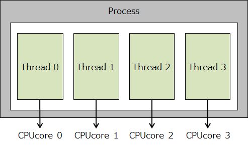
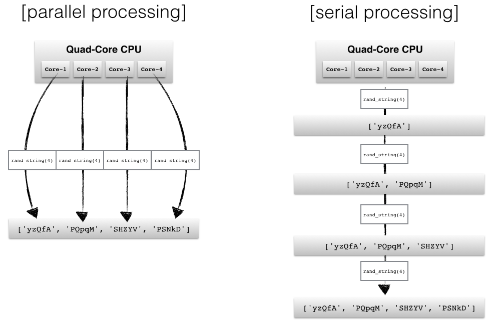
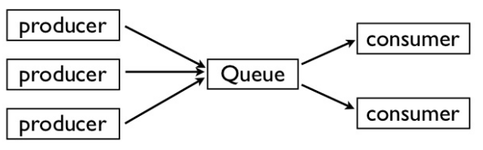
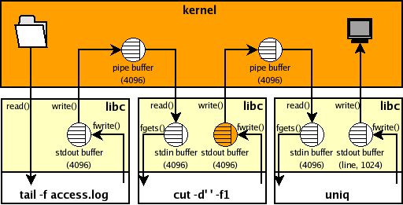

# Diving into Python's Multiprocessing Module

## Thread based Parallelism
- Share the **memory** and **state** of the parent
- Are **light weight**
- Do not use Inter-Process Communication or messaging
- Python threads are **Posix Threads - pthreads**, real OS/Kernel level
- Python only allows a **single thread** to be executing within the interpreter **at once**. This restriction is enforced by the **GIL**
- **GIL (Global Interpreter Locker)** - this is a lock which must be acquired for a thread to enter the interpreter's space.
- **Only one** thread may be executing within the Python interpreter at once.
- GIL is not a bug. It is an implementation detail of **CPython** interpreter because it makes the maintenance easier.
- **I/O, sockets and http** communications don't suffer to much because the GIL.

## Process based Parallelism
- To solve **large problems** in a relatively **short time**
- Share nothing or little is **safer** than share everything
- They are **heavy weight** (in comparison to threads)
- Processes are "**share nothing**" - programmers must explicitly share any data/state - this means that the programmers are forced to **think** about what is being shared
- **Easier** to turn into a **distributed** application
- Most part of the time, they are **faster than threads** in Python, **because the GIL** problem

## Multiprocessing Module

- Part of the **standard library** of the language added in Python 2.6
	- **import multiprocessing**
- **Originally** known as **pyprocessing** (a third-party extension module)
- This is a module for writing concurrent Python programs based on communicating processes
- A module that is **especially useful** for concurrent **CPU-bound** processing
- Using this module, there are **no shared data structures**, every process is completely **isolated**, so forget about all of that locking business
- **Everything** is focused on **messaging**
- Implements the **shared memory** programming paradigm
	- Multiple processors acessing a common memory
- Parent process **spawn a child process** and can continue its execution normally (assynchronously)
- It implements the **same API that threading module**, but it uses processes
- It offers **distributed-computing** facilities as well
- It **allows** data/memory sharing
- It is a great **alternative** to step aside the **GIL** problem

### Work with Proccesses or Threads

- multiprocessing.pool.ThreadPool
	- For threads
- multiprocessing.pool.Pool
	- For processes

### Supported ways of Communication

- **Queues**
	- [https://docs.python.org/3.7/library/multiprocessing.html#multiprocessing.Queue](https://docs.python.org/3.7/library/multiprocessing.html#multiprocessing.Queue) 
	
	- A queue supports **multiple producers** and **multiple consumers**
	- It could be a normal **Queue** or a **JoinableQueue**
	- It is thread and process safe
	- The **multiprocessing Queue** is a **clone** of traditional **Queue.queue**
	
 
	
- **Pipes**
	- [https://docs.python.org/3.7/library/multiprocessing.html#multiprocessing.Pipe](https://docs.python.org/3.7/library/multiprocessing.html#multiprocessing.Pipe)
	
	- A pipe is basically a **block of memory** in the kernel, a buffer that is read/written by some processes. The advantage of using pipes is that it has **2 files descriptors associated** with it, and thus sharing data between 2 processes is **as simple as reading/writing to a file**.
	- The pipe could be used in a **Linux shell**, like this: **cat foobar | wc -l**
	- It returns a pair of connection objects connected by a pipe which by default is duplex (two-way)
	- **It can only have two endpoints** - One of them should be used for read while the another for write in order to avoid risk of corruption
	- **Faster** than queues - See the following benchmarking
		- [https://github.com/victorjabur/presentations/blob/master/python_parallelism/part_2_multiprocessing/performance_pipe_queue_joinablequeue/results.txt](https://github.com/victorjabur/presentations/blob/master/python_parallelism/part_2_multiprocessing/performance_pipe_queue_joinablequeue/results.txt)
	- You can send and receive Python objects (they will be serialized using pickle) using the communication channel

**Pipes in a Linux Shell Command**
In the following picture, you can see pipes in action inside the Linux when you type a command like this: "tail -f access.log | cut -d'' -f1 | uniq"

 

## Pool Class

 Pool object offers a convenient means of parallelizing the execution of a function across multiple input values, distributing the input data across processes (data parallelism). 
 
 A process pool object which controls a pool of worker processes to which jobs can be submitted. It supports asynchronous results with timeouts and callbacks and has a parallel map implementation.
 
- **Function  Options:**
	- **apply(func[, args[, kwds]])**
		- It blocks until the result is ready
		- Worker function is executed in one of the workers of the pool
		- The worker function runs in another proccess
		- It is not concurrent :-(
		
	- **apply_async(func[, args[, kwds[, callback[, error_callback]]]])**
		- Variant of apply
		- It returns a result object
		- Accepts the callback() and error_callback() functions to receive results
		- Concurrent :-)
		- Callback blocks the execution of workers, so make it simple (if used)
		- The result is a proxy of class multiprocessing.pool.AsyncResult -> get() / wait() / ready() / succesful()
		
	- **map(func, iterable[, chunksize])**
		- It is a parallel equivalent of the map() function
		- It supports only one iterable argument
		- It blocks until the result is ready
		- The return is a list with all the results :-()
		- The chuncksize will be calculated automatically using an internal formula, in case you don't set it

	- **map_async(func, iterable[, chunksize[, callback[, error_callback]]])**
		- A parallel equivalent of map
		- It returns a result object
		- Accepts the callback() and error_callback() functions to receive results
		- Concurrent :-)
		- Callback blocks the execution of workers, so make it simple (if used)		
		- The result is a proxy of class multiprocessing.pool.AsyncResult -> get() / wait() / ready() / succesful()
	
	- **imap(func, iterable[, chunksize])**
		- A lazier version of map
		- For long iterables, please increase your chunksize
		- The result is an iterator which means the result comes to you gradually
		- The chuncksize will be set to 1, in case you don't set it
	
	- **imap_unordered(func, iterable[, chunksize])**
		- All characteristcs from imap version is inherited
		- You receive faster your results (processing time), but the total time will be almost the same
		- It uses less memory than imap, because the faster results will go back to you as soon as possible, releasing the memory earlier
		- If you need the pair (input, result) you need to return it from worker function, because the order is not respected
	
	- **starmap(func, iterable[, chunksize])**
	
	- **starmap_async(func, iterable[, chunksize[, callback[, error_back]]])**
		- The result is a proxy of class multiprocessing.pool.AsyncResult -> get() / wait() / ready() / succesful()

|   | multi-args  | concurrence   | blocking   | ordered-results   |
|---|---|---|---|---|
| apply                   | yes  | no     | yes  | no   |
| apply_async        | yes  | yes   | no    | no   |
| map                     | no    | yes   | yes  | yes   |
| map_async          | no    | yes   | no    | yes   |
| imap                    | no    | yes    | no   | yes   |
| imap_unordered  | no    |  yes   | no   | no   |
| starmap               | yes  | yes    | yes  | yes   |
| starmap_async    | yes  |  yes   | no   | yes   |

- More info about the class multiprocessing.pool.AsyncResult:
	- get() - returns the result if available / otherwise blocks until ready()
		- To avoid unwanted block you can use get(timeout=5) which will raise an exception multiprocessing.TimeoutError
	- wait() - blocks until the result is ready() but accept the timeout as well
	- succesful() tells you that te execution was ok

- How to pass multiple parameters to your worker function
	- from functools import partial
	- func = partial(worker_func, kit_fat)

## Reference Links

- Take a look at the Official Documentation here:
	- [https://docs.python.org/3.7/library/multiprocessing.html](https://docs.python.org/3.7/library/multiprocessing.html)
- David Beazley - An Introduction to Python Concurrency - USENIX - San Diego, 2009
	- [https://www.slideshare.net/dabeaz/an-introduction-to-python-concurrency](https://www.slideshare.net/dabeaz/an-introduction-to-python-concurrency)
- David Beazley - Python Concurrency From the Ground Up: LIVE! - PyCon US, 2015
	- [http://pyvideo.org/video/3432/python-concurrency-from-the-ground-up-live](http://pyvideo.org/video/3432/python-concurrency-from-the-ground-up-live)
- Jesse Noller - Getting started with Concurrency - PyWorks - Atlanta, 2008
	- [https://www.slideshare.net/pvergain/multiprocessing-with-python-presentation](https://www.slideshare.net/pvergain/multiprocessing-with-python-presentation)
- Bernd Klein - Python Course - Pipes in Python
	- [http://www.python-course.eu/pipes.php](http://www.python-course.eu/pipes.php)
- Book: Python Parallel Programming Cookbook
	- Master efficient parallel programming to build powerful applications using Python
	[https://www.packtpub.com/application-development/python-parallel-programming-cookbook](https://www.packtpub.com/application-development/python-parallel-programming-cookbook)
	- Concurrent and Parallel Programming in Python - Part 1
	[https://blog.sopticek.net/2017/05/13/concurrent-and-parallel-programming-in-python-part-1/](https://blog.sopticek.net/2017/05/13/concurrent-and-parallel-programming-in-python-part-1/)
	- Concurrent and Parallel Programming in Python - Part 2
	[https://blog.sopticek.net/2017/06/03/concurrent-and-parallel-programming-in-python-part-2/](https://blog.sopticek.net/2017/06/03/concurrent-and-parallel-programming-in-python-part-2/)
	- Python multiprocessing.Pool: Difference between map, apply, map_async, apply_async
	[http://blog.shenwei.me/python-multiprocessing-pool-difference-between-map-apply-map_async-apply_async/](http://blog.shenwei.me/python-multiprocessing-pool-difference-between-map-apply-map_async-apply_async/)

## Parts of this Presentation

Here are some topics covered in this presentation: 

- Threads and Native Lockings (Part 1)
	- [https://github.com/victorjabur/presentations/tree/master/python_parallelism/part_1_threads](https://github.com/victorjabur/presentations/tree/master/python_parallelism/part_1_threads)
- Processes and Multiprocessing Module (Part 2)
	- [https://github.com/victorjabur/presentations/tree/master/python_parallelism/part_2_multiprocessing](https://github.com/victorjabur/presentations/tree/master/python_parallelism/part_2_multiprocessing)
- Concurrent.futures module in Python 3.2 (Part 3)
- Asyncio module in Python 3.4 (Part 4)
- Async/await syntax for native coroutines in Python 3.5 (Part 5)

## Take a Time for Reflection
 
